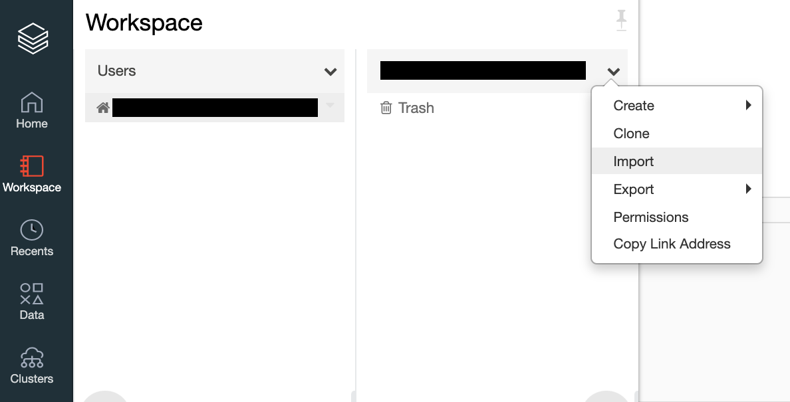
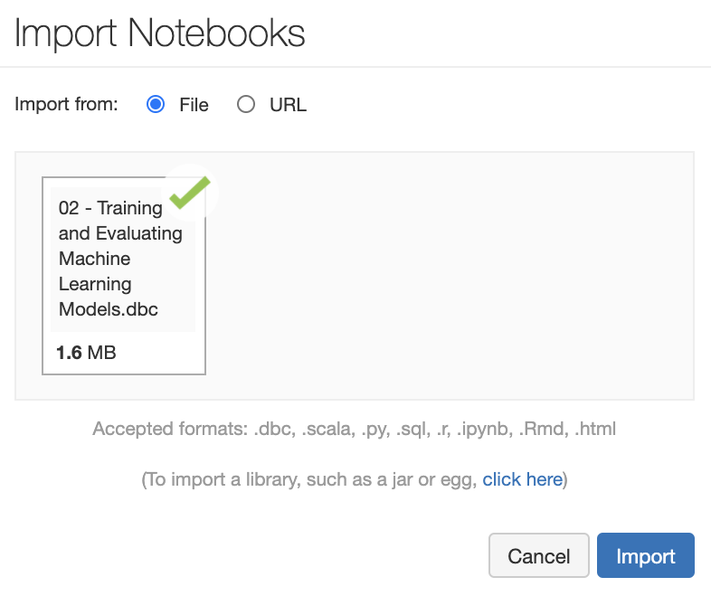

---
lab:
    title: 'Training and Validating a Machine Learning Model'
---
# Training and Validating a Machine Learning Model

Machine Learning is primarily about training models that you can use to provide predictive services to applications. In this exercise, you'll see how you can use Azure Databricks to train and validate a machine learning model. To begin, you need to have access to an Azure Databricks workspace with an interactive cluster. If you do not have a workspace and/or the required cluster, follow the instructions below. Otherwise, you can skip to the section [Upload the Databricks notebook archive](#Upload-the-Databricks-notebook-archive).

## Unit Pre-requisites

**Microsoft Azure Account**: You will need a valid and active Azure account for the Azure labs. If you do not have one, you can sign up for a [free trial](https://azure.microsoft.com/free/)

- If you are a Visual Studio Active Subscriber, you are entitled to Azure credits per month. You can refer to this [link](https://azure.microsoft.com/pricing/member-offers/credit-for-visual-studio-subscribers/) to find out more including how to activate and start using your monthly Azure credit.

- If you are not a Visual Studio Subscriber, you can sign up for the FREE [Visual Studio Dev Essentials](https://www.visualstudio.com/dev-essentials/) program to create Azure free account (includes 1 year of free services, $200 for 1st month).

## Create the required resources

To complete this exercise, you will need to deploy an Azure Databricks workspace in your Azure subscription.

### Deploy an Azure Databricks workspace

1. Click the following button to open the Azure Resource Manager template in the Azure Portal.
   [Deploy Databricks from the Azure Resource Manager Template](https://portal.azure.com/#create/Microsoft.Template/uri/https%3A%2F%2Fraw.githubusercontent.com%2FAzure%2Fazure-quickstart-templates%2Fmaster%2F101-databricks-workspace%2Fazuredeploy.json)

1. Provide the required values to create your Azure Databricks workspace:

   - **Subscription**: Choose the Azure Subscription in which to deploy the workspace.
   - **Resource Group**: Leave at Create new and provide a name for the new resource group.
   - **Location**: Select a location near you for deployment. For the list of regions supported by Azure Databricks, see [Azure services available by region](https://azure.microsoft.com/regions/services/).
   - **Workspace Name**: Provide a name for your workspace.
   - **Pricing Tier**: Ensure `premium` is selected.

1. Select **Review + create**.
1. Select **Create**.
1. The workspace creation takes a few minutes. During workspace creation, the portal displays the Submitting deployment for Azure Databricks tile on the right side. You may need to scroll right on your dashboard to see the tile. There is also a progress bar displayed near the top of the screen. You can watch either area for progress.

### Create a cluster

1. When your Azure Databricks workspace creation is complete, select the link to go to the resource.

1. Select **Launch Workspace** to open your Databricks workspace in a new tab.

1. In the left-hand menu of your Databricks workspace, select **Clusters**.

1. Select **Create Cluster** to add a new cluster.

    

1. Enter a name for your cluster. Use your name or initials to easily differentiate your cluster from your coworkers.

1. Select the **Databricks RuntimeVersion**: **Runtime: 7.3 LTS ML (Scala 2.12, Spark 3.0.1)** (remember to select the **ML** version).

1. Select the values for the cluster configuration.
    - **Enable autoscaling**: **Uncheck** this option.

    - **Auto Termination**: Leave **checked** and in the text box enter `120`.

    - **Worker Type**: **Standard_DS3_v2**

    - **Workers**: `1`

    - **Driver Type**: **Same as worker**

1. Select **Create Cluster**.

### Upload the Databricks notebook archive

1. If you have already uploaded the Databricks notebook archive **02 - Training and Evaluating Machine Learning Models.dbc** to your workspace, you can skip to the section [Upload the model training data](#Upload-the-model-training-data).

1. Select the link below to download the `Databricks notebook archive` file to your local computer:

   [02 - Training and Evaluating Machine Learning Models.dbc](https://github.com/MicrosoftLearning/dp-090-databricks-ml/blob/master/02%20-%20Training%20and%20Evaluating%20Machine%20Learning%20Models.dbc?raw=true)

1. Within the Azure Databricks Workspace, using the command bar on the left, select **Workspace**, **Users** and select your username (the entry with house icon).

1. In the blade that appears, select the downwards pointing chevron next to your name, and select **Import**.

    

1. On the Import Notebooks dialog, browse and open the `02 - Training and Evaluating Machine Learning Models.dbc` file from your local computer and then select **Import**.

    

1. A folder named after the archive should appear. Select that folder.

1. The folder will contain one or more notebooks. These are the notebooks you will use in completing this exercise.

### Upload the model training data

1. If you have already created the table **nyc_taxi** in your workspace, you can skip to the section [Exercise: Training and Validating a Machine Learning Model](#Exercise-Training-and-Validating-a-Machine-Learning-Model).

1. Open the link below in a new browser tab and then **right-click + Save as** to download the data file to your local computer. Save the file as **csv**, and name it `nyc-taxi.csv`.

   [nyc-taxi.csv](https://github.com/MicrosoftLearning/dp-090-databricks-ml/blob/master/data/nyc-taxi.csv?raw=true)

1. Within the Azure Databricks Workspace, select **Import & Explore Data**.

    

1. Upload the `nyc-taxi.csv` file from your local compute and then select **Create Table with UI**.

    

1. Select your cluster and then select **Preview Table**.

    

1. Provide the following information then select **Create Table**.

    - **Table Name**: `nyc_taxi`
    - **File Type**: `csv`
    - **Column Delimiter**: `,`
    - **First row is header**: `checked`
    - **Infer schema**: `checked`
    - **Multi-line**: `unchecked`

    

## Exercise: Training and Validating a Machine Learning Model

In this exercise, you will learn to train and validate a machine learning model that is provided in a notebook.

1. Within the Azure Databricks Workspace, using the command bar on the left, select **Workspace**, **Users** and select your username (the entry with house icon). Open the folder named **02 - Training and Evaluating Machine Learning Models** to find the notebook **2.0 Train and Validate ML Model**.

1. Then read the notes in the notebook, running each code cell in turn.

## Clean-up

If you're finished working with Azure Databricks for now, in Azure Databricks workspace, on the **Clusters** page, select your cluster and select **Terminate** to shut it down. Otherwise, leave it running for the next exercise.
