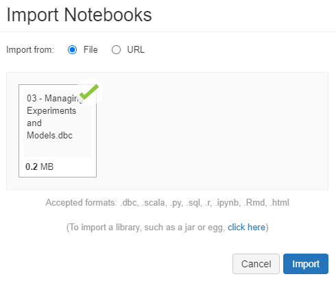

---
lab:
    title: 'Using MLflow to Track Experiments'
---
# Using MLflow to Track Experiments

MLflow is a fully-featured model tracking and registry system.  In this exercise, you will use MLflow to collect model training artifacts, metrics, and parameters.  You will then be able to view those outputs through the Azure Databricks UI or programmatically. To begin, you need to have access to an Azure Databricks workspace with an interactive cluster. If you do not have a workspace and/or the required cluster, follow the instructions below. Otherwise, you can skip to the section [Upload the Databricks notebook archive](#Upload-the-Databricks-notebook-archive).

## Unit Pre-requisites

**Microsoft Azure Account**: You will need a valid and active Azure account for the Azure labs. If you do not have one, you can sign up for a [free trial](https://azure.microsoft.com/free/)

- If you are a Visual Studio Active Subscriber, you are entitled to Azure credits per month. You can refer to this [link](https://azure.microsoft.com/pricing/member-offers/credit-for-visual-studio-subscribers/) to find out more including how to activate and start using your monthly Azure credit.

- If you are not a Visual Studio Subscriber, you can sign up for the FREE [Visual Studio Dev Essentials](https://www.visualstudio.com/dev-essentials/) program to create Azure free account (includes 1 year of free services, $200 for 1st month).

## Create the required resources

To complete this exercise, you will need to deploy an Azure Databricks workspace in your Azure subscription.

### Deploy an Azure Databricks workspace

1. Click the following button to open the Azure Resource Manager template in the Azure Portal.
   [Deploy Databricks from the Azure Resource Manager Template](https://portal.azure.com/#create/Microsoft.Template/uri/https%3A%2F%2Fraw.githubusercontent.com%2FAzure%2Fazure-quickstart-templates%2Fmaster%2F101-databricks-workspace%2Fazuredeploy.json)

1. Provide the required values to create your Azure Databricks workspace:

   - **Subscription**: Choose the Azure Subscription in which to deploy the workspace.
   - **Resource Group**: Leave at Create new and provide a name for the new resource group.
   - **Location**: Select a location near you for deployment. For the list of regions supported by Azure Databricks, see [Azure services available by region](https://azure.microsoft.com/regions/services/).
   - **Workspace Name**: Provide a name for your workspace.
   - **Pricing Tier**: Ensure `premium` is selected.

1. Select **Review + create**.
1. Select **Create**.
1. The workspace creation takes a few minutes. During workspace creation, the portal displays the Submitting deployment for Azure Databricks tile on the right side. You may need to scroll right on your dashboard to see the tile. There is also a progress bar displayed near the top of the screen. You can watch either area for progress.

### Create a cluster

1. When your Azure Databricks workspace creation is complete, select the link to go to the resource.

1. Select **Launch Workspace** to open your Databricks workspace in a new tab.

1. In the left-hand menu of your Databricks workspace, select **Clusters**.

1. Select **Create Cluster** to add a new cluster.

    

1. Enter a name for your cluster. Use your name or initials to easily differentiate your cluster from your coworkers.

1. Select the **Databricks RuntimeVersion**: **Runtime: 7.3 LTS ML (Scala 2.12, Spark 3.0.1)** (remember to select the **ML** version).

1. Select the values for the cluster configuration.
    - **Enable autoscaling**: **Uncheck** this option.

    - **Auto Termination**: Leave **checked** and in the text box enter `120`.

    - **Worker Type**: **Standard_DS3_v2**

    - **Workers**: `1`

    - **Driver Type**: **Same as worker**

1. Select **Create Cluster**.

### Upload the Databricks notebook archive

1. If you have already uploaded the Databricks notebook archive **03 - Managing Experiments and Models.dbc** to your workspace, you can skip to the section [Exercise: Using MLflow to Track Experiments](#Exercise-Using-MLflow-to-Track-Experiments).

2. Select the link below to download the `Databricks notebook archive` file to your local computer:

   [03 - Managing Experiments and Models.dbc](https://github.com/MicrosoftLearning/dp-090-databricks-ml/blob/master/03%20-%20Managing%20Experiments%20and%20Models.dbc?raw=true)

3. Within the Azure Databricks Workspace, using the command bar on the left, select **Workspace**, **Users** and select your username (the entry with house icon).

4. In the blade that appears, select the downwards pointing chevron next to your name, and select **Import**.

    

5. On the Import Notebooks dialog, browse and open the `03 - Managing Experiments and Models.dbc` file from your local computer and then select **Import**.

    

6. A folder named after the archive should appear. Select that folder.

7. The folder will contain one or more notebooks. These are the notebooks you will use in completing this exercise.

## Exercise: Using MLflow to Track Experiments

In this exercise, you will learn to prepare training data for machine learning purposes as shown in the notebook.

1. Within the Azure Databricks Workspace, using the command bar on the left, select **Workspace**, **Users** and select your username (the entry with house icon). Open the folder named **03 - Managing Experiments and Models** to find the notebook **01 - Using MLflow to Track Experiments**.

1. Then read the notes in the notebook, running each code cell in turn.  In the section entitled **View the Experiment, Runs, and Run Details with the Databricks UI**, there will be instructions on what actions to perform, as these actions will take place outside of the confines of a notebook.  It may be easiest to open up a second tab in your browser and perform these actions in that tab while reviewing the instructions in the notebook.

## Clean-up

If you're finished working with Azure Databricks for now, in Azure Databricks workspace, on the **Clusters** page, select your cluster and select **Terminate** to shut it down. Otherwise, leave it running for the next exercise.
