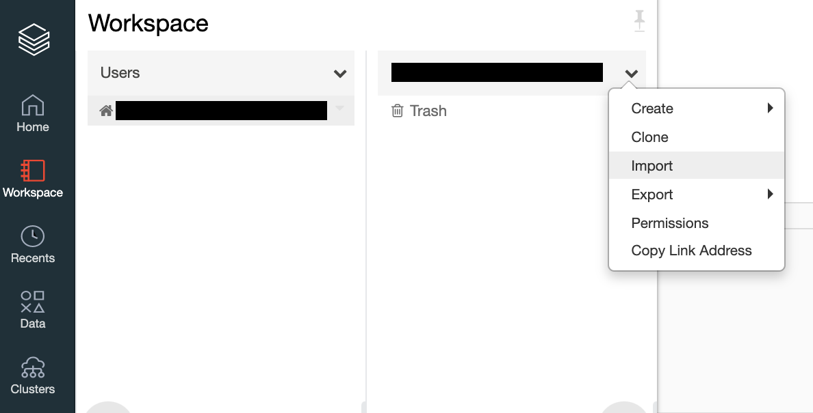
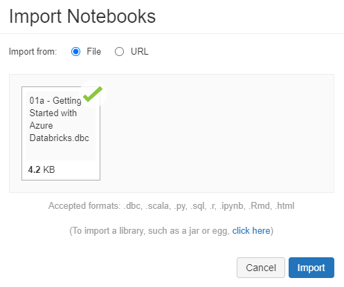

---
lab:
    title: 'Getting Started with Azure Databricks'
---
# Getting Started with Azure Databricks

Azure Databricks is a fast, easy and collaborative Spark based analytics service. It is used to accelerate big data analytics, artificial intelligence, performant data lakes, interactive data science, machine learning and collaboration.
You will discover the Azure Databricks environment and the main topics around it: workspace, cluster, notebook.

To begin, you need to have access to an Azure Databricks workspace with an interactive cluster. If you do not have a workspace and/or the required cluster, follow the instructions below. Otherwise, you can skip to the section [Upload the Databricks notebook archive](#Upload-the-Databricks-notebook-archive).

## Unit Pre-requisites

**Microsoft Azure Account**: You will need a valid and active Azure account for the Azure labs. If you do not have one, you can sign up for a [free trial](https://azure.microsoft.com/free/)

- If you are a Visual Studio Active Subscriber, you are entitled to Azure credits per month. You can refer to this [link](https://azure.microsoft.com/pricing/member-offers/credit-for-visual-studio-subscribers/) to find out more including how to activate and start using your monthly Azure credit.

- If you are not a Visual Studio Subscriber, you can sign up for the FREE [Visual Studio Dev Essentials](https://www.visualstudio.com/dev-essentials/) program to create Azure free account (includes 1 year of free services, $200 for 1st month).

## Create the required resources

To complete this exercise, you will need to deploy an Azure Databricks workspace in your Azure subscription.

### Deploy an Azure Databricks workspace

1. Go to the the [Azure Portal](https://portal.azure.com). Click on the `Create a resource` button.

1. The `New` window appears. Enter the type of your resource. Type `Azure Databricks`, then press Enter.

1. The `Azure Databricks` window appears. Click on the `Create` button.

1. The `Create an Azure Databricks workspace` window appears. Configure your new Databricks resource as follows:

   - **Subscription**: Choose the Azure Subscription in which to deploy the workspace.
   - **Resource Group**: Leave at Create new and provide a name for the new resource group.
   - **Workspace Name**: Provide a name for your workspace.
   - **Region**: Select a location near you for deployment. For the list of regions supported by Azure Databricks, see [Azure services available by region](https://azure.microsoft.com/regions/services/).
   - **Pricing Tier**: Ensure `standard` is selected.

1. Select **Review + create**.

1. Wait until the message "Validation Succeeded" appears.  Select **Create**.

1. The workspace creation takes a few minutes. During workspace creation, the portal displays the Submitting deployment for Azure Databricks tile on the right side. You may need to scroll right on your dashboard to see the tile. There is also a progress bar displayed near the top of the screen. You can watch either area for progress.

### Create a cluster

1. When your Azure Databricks workspace creation is complete, select the link to go to the resource.

1. Select **Launch Workspace** to open your Databricks workspace in a new tab.

1. In the left-hand menu of your Databricks workspace, select **Clusters**.

1. Select **Create Cluster** to add a new cluster.

    

1. Enter a name for your cluster. Use your name or initials to easily differentiate your cluster from your coworkers.

1. Select `Cluster Mode` as `Single Node`. Leave `Pool` set to `None`.

1. Select the **Databricks RuntimeVersion**: **Runtime: 8.1 LTS ML (Scala 2.12, Spark 3.1.1)** (remember to select the **ML** version).

1. Select the values for the cluster configuration.

    - **Terminate after**: Leave **checked** and in the text box enter `120`.

    - **Node Type**: **Standard_DS3_v2**

1. Select **Create Cluster**.

### Upload the Databricks notebooks

1. Select the links below to download the `Databricks notebook archive` files to your local computer:

   [01 - Introduction to Azure Databricks.dbc](/01%20-%20Introduction%20to%20Azure%20Databricks.dbc?raw=true)
   [02 - Training and Evaluating Machine Learning Models.dbc](/02%20-%20Training%20and%20Evaluating%20Machine%20Learning%20Models.dbc?raw=true)
   [03 - Managing Experiments and Models.dbc](/03%20-%20Managing%20Experiments%20and%20Models.dbc?raw=true)
   [04 - Integrating Azure Databricks and Azure Machine Learning.dbc](/04%20-%20Integrating%20Azure%20Databricks%20and%20Azure%20Machine%20Learning.dbc?raw=true)

1. Within the Azure Databricks Workspace, using the command bar on the left, select **Workspace**, **Users** and select your username (the entry with house icon).

1. In the blade that appears, select the downwards pointing chevron next to your name, and select **Import**.

    

1. On the Import Notebooks dialog, browse and open the downloaded .dbc files from your local computer, one at a time, and then select **Import**.

    

1. For each .dbc file you will get a notebook with the same name. 

## Exercise: Getting Started with Azure Databricks

In this exercise, you will discover the Azure Databricks environment.

1. Within the Azure Databricks Workspace, using the command bar on the left, select **Workspace**, **Users** and select your username (the entry with house icon). Open the notebook named **Introduction to Azure Databricks**.

2. Then read the notes in the notebook, running each code cell in turn.

## Clean-up

If you're finished working with Azure Databricks for now, in Azure Databricks workspace, on the **Clusters** page, select your cluster and select **Terminate** to shut it down. Otherwise, leave it running for the next exercise.
