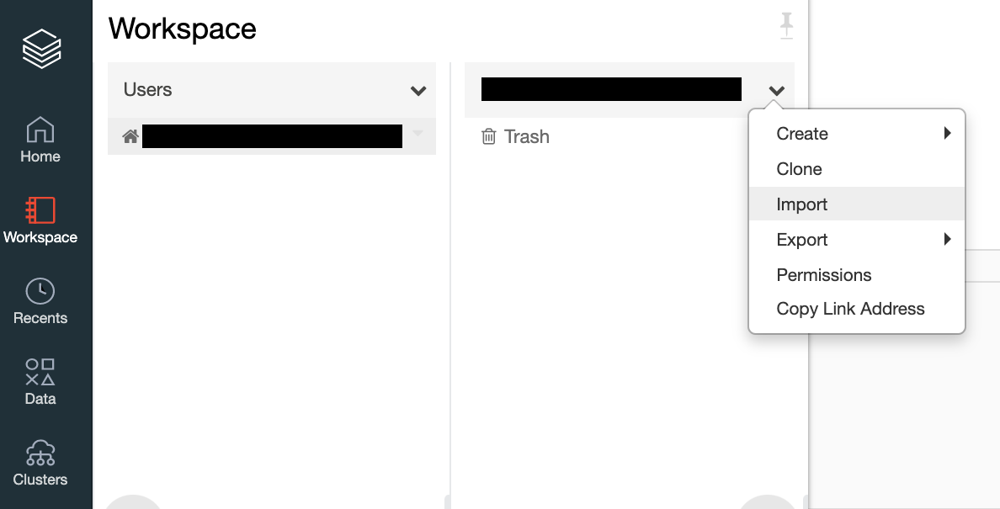

---
lab:
    title: 'Working with Data in Azure Databricks'
---
# Working with Data in Azure Databricks

You will learn to load your data by using DBFS and manipulate it by using Spark Dataframes.
Databricks File System (DBFS) is a distributed file system mounted into a Databricks workspace and available on Databricks clusters.
DataFrames are the distributed collections of data allowing the processing of huge amounts of data.

To begin, you need to have access to an Azure Databricks workspace with an interactive cluster. If you do not have a workspace and/or the required cluster, follow the instructions below. Otherwise, you can skip to the section [Upload the Databricks notebook archive](#Upload-the-Databricks-notebook-archive).

## Unit Pre-requisites

Assuming you have completed the previous lab, you have a working setup already. A cluster is available and your workspace exists.

To add code and data, follow the steps below.

### Upload the Databricks notebook archive

1. If you have already uploaded the Databricks notebook archive **01b - Working with Data in Azure Databricks.dbc** to your workspace, you can skip to the section [Exercise: Working with Data in Azure Databricks](#Exercise-Working-with-Data-in-Azure-Databricks).

2. Select the link below to download the `Databricks notebook archive` file to your local computer:

   [01b - Working with data in Azure Databricks.dbc](/01b%20-%20Working%20with%20data%20in%20Azure%20Databricks.dbc?raw=true)

3. Within the Azure Databricks Workspace, using the command bar on the left, select **Workspace**, **Users** and select your username (the entry with house icon).

4. In the blade that appears, select the downwards pointing chevron next to your name, and select **Import**.

    

5. On the Import Notebooks dialog, browse and open the `01b - Working with data in Azure Databricks.dbc` file from your local computer and then select **Import**.

    

6. A notebook named after the .dbc file should appear. Select that notebook.

### Upload your data files

1. If you have already created the table **sales** in your workspace, you can skip to the section [Exercise: Working with Data in Azure Databricks](#Exercise-Working-with-Data-in-Azure-Databricks).

2. Open the link below in a new browser tab and then **right-click + Save as** to download the data file to your local computer. Save the file as **csv**, make sure to explicitly add the csv extension, name it `sales.csv`.

   [sales.csv](/data/sales.csv?raw=true)

3. Within the Azure Databricks Workspace, select **Import & Explore Data**.

    

4. Upload the `sales.csv` file from your local compute and then select **Create Table with UI**.

    

5. Select your cluster and then select **Preview Table**.

    

6. Provide the following information then select **Create Table**.

    - **Table Name**: `sales_csv`
    - **File Type**: `csv`
    - **Column Delimiter**: `,`
    - **First row is header**: `checked`
    - **Infer schema**: `checked`
    - **Multi-line**: `unchecked`

    

7. Repeat steps 1-6 for file [sales-telem.csv](/data/sales-telem.csv?raw=true). 
Import it and create the `sales_telem_csv` table.

## Exercise: Working with Data in Azure Databricks

In this exercise, you will learn how to load and manipulate data inside the Azure Databricks environment.

1. Within the Azure Databricks Workspace, using the command bar on the left, select **Workspace**, **Users** and select your username (the entry with house icon). Open the folder named **01 - Introduction to Azure Databricks** to find the notebook **01b - Working with data in Azure Databricks**.

2. Then read the notes in the notebook, running each code cell in turn.  In the section entitled **View the Experiment, Runs, and Run Details with the Databricks UI**, there will be instructions on what actions to perform, as these actions will take place outside of the confines of a notebook.  It may be easiest to open up a second tab in your browser and perform these actions in that tab while reviewing the instructions in the notebook.

## Clean-up

If you're finished working with Azure Databricks for now, in Azure Databricks workspace, on the **Clusters** page, select your cluster and select **Terminate** to shut it down. Otherwise, leave it running for the next exercise.
